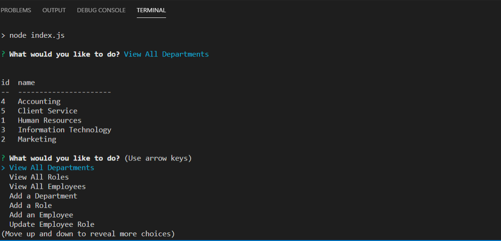
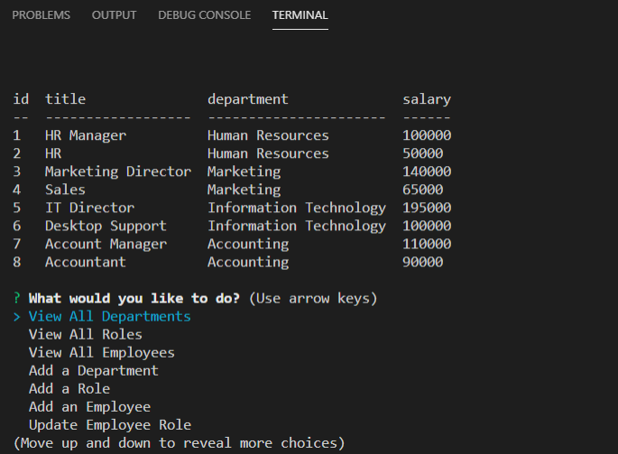
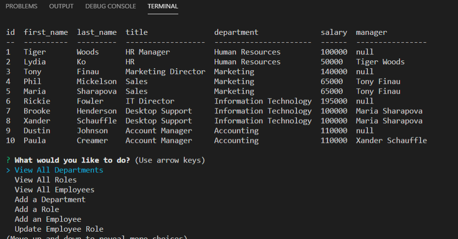
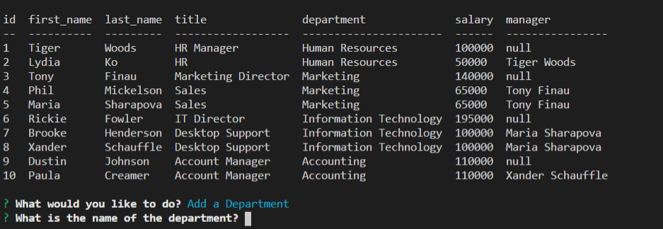
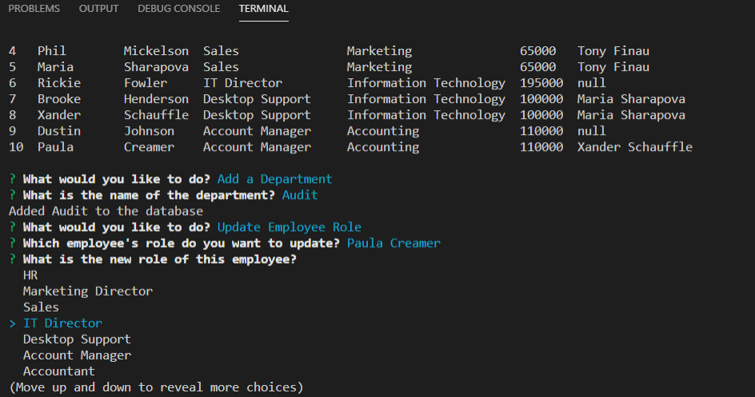

# Employee Tracker
Application that allows user to view and manage departments, roles, and employees information.

## Table of Contents
* Overview
* Technologies
* Status
* Screenshot

## Overview
This is an assignment using Node, NPM, MySQL, Inquirer.js, MySQL2, and console.table. The goal of the assignment is to create an app that generates a team profile generator file for the user. The below link will guide the user how to use the application. I have included a screenshot of the appication.

## Technologies
Project created with:
* Node
* NPM
* MySQL
* MySqL2
* Inquirer
* console.table

## Status
To view a user guide of my project please visit the below.

[Employee Tracker Guide](https://drive.google.com/file/d/1PgmQ2yx4BQ30uAVLixYM91rZy5TUvvw3/view)

## Screenshot

)
)
)
)
)
